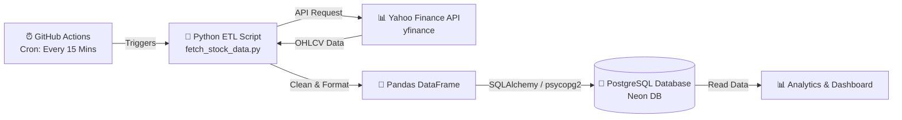

# 📈 Stock Market Analytics & Automated Data Pipeline

[](https://github.com/Ishantaneja/Stock-Market-analytics/actions/workflows/stock_pipeline.yml)


An automated, serverless end-to-end stock market data pipeline and analytics repository designed to fetch, process, and persist intraday Indian stock market (NSE) data to a cloud PostgreSQL database at regular intervals.

---

## 📌 Project Overview

This project provides an automated ETL (Extract, Transform, Load) pipeline for tracking high-volume Indian equity stocks (NIFTY 50 heavyweights). Running entirely on a scheduled cloud workflow (GitHub Actions), the pipeline pulls real-time intraday market quotes via Yahoo Finance, structures the OHLCV metrics, and appends them to a remote PostgreSQL database (such as Neon Serverless Postgres).

The stored data serves as the foundation for downstream quantitative analysis, historical trend monitoring, technical indicators, and interactive dashboards.

---

## 🏗️ Architecture & Pipeline Flow



1. **Extraction**: Downloads the latest 5-day / 5-minute interval OHLCV records for specified NSE stock tickers using `yfinance`.
2. **Transformation**: Resolves MultiIndex structures, validates price series, and formats fields (timestamps, prices, volumes) using `pandas`.
3. **Loading**: Ingests transformed records into the `stock_prices` database table via `SQLAlchemy`.
4. **Automation**: Executes automatically every 15 minutes during trading windows via GitHub Actions scheduled workflows.

---

## 📊 Tracked Stocks

Currently, the pipeline monitors key market leaders on the National Stock Exchange of India (NSE):

| Ticker | Company Name | Sector |
| :--- | :--- | :--- |
| `RELIANCE.NS` | Reliance Industries Ltd. | Conglomerate / Energy |
| `TCS.NS` | Tata Consultancy Services Ltd. | IT Services & Consulting |
| `INFY.NS` | Infosys Ltd. | IT Services & Consulting |
| `HDFCBANK.NS` | HDFC Bank Ltd. | Banking & Financials |
| `ICICIBANK.NS` | ICICI Bank Ltd. | Banking & Financials |

---

## 🗄️ Database Schema

Records are appended to the `stock_prices` table with the following schema:

| Column | Type | Description |
| :--- | :--- | :--- |
| `timestamp` | `TIMESTAMP` | Record timestamp when data was fetched |
| `symbol` | `VARCHAR` | Stock ticker symbol (e.g. `RELIANCE.NS`) |
| `current_price` | `FLOAT` | Latest closing price |
| `open_price` | `FLOAT` | Opening price for the period |
| `high_price` | `FLOAT` | Highest price reached in the period |
| `low_price` | `FLOAT` | Lowest price reached in the period |
| `volume` | `BIGINT` | Trading volume in the period |

---

## 📁 Repository Structure

```text
stock-market-analytics/
├── .github/
│   └── workflows/
│       └── stock_pipeline.yml    # GitHub Actions workflow (15-min cron + manual dispatch)
├── Dashboard/                    # Interactive dashboards (Streamlit / Dash / PowerBI)
├── data/                         # Local storage for CSVs, historical exports, and caches
├── docs/                         # Additional project documentation, diagrams, and notes
├── scripts/
│   ├── fetch_stock_data.py       # Core ETL ingestion script
│   └── Sample.py                 # Local test/verification script
├── SQL/                          # SQL schemas, analytical queries, and views
├── requirements.txt              # Python library dependencies
└── README.md                     # Project documentation
```

---

## ⚙️ Setup & Installation

### 1. Prerequisites
- Python 3.10+
- Access to a PostgreSQL database (e.g., [Neon](https://neon.tech), Supabase, or a local PostgreSQL instance)
- Git

### 2. Clone the Repository
```bash
git clone https://github.com/Ishantaneja/Stock-Market-analytics.git
cd Stock-Market-analytics
```

### 3. Create & Activate Virtual Environment
```bash
# Windows
python -m venv .venv
.venv\Scripts\activate

# macOS / Linux
python3 -m venv .venv
source .venv/bin/activate
```

### 4. Install Dependencies
```bash
pip install -r requirements.txt
```

### 5. Configure Environment Variables
Set the `DATABASE_URL` environment variable pointing to your PostgreSQL instance:

```bash
# Windows (PowerShell)
$env:DATABASE_URL="postgresql://<username>:<password>@<host>/<database>?sslmode=require"

# Windows (Command Prompt)
set DATABASE_URL=postgresql://<username>:<password>@<host>/<database>?sslmode=require

# Linux / macOS (Bash / Zsh)
export DATABASE_URL="postgresql://<username>:<password>@<host>/<database>?sslmode=require"
```

> [!WARNING]
> Never commit database credentials or connection strings to version control. Always use environment variables or a `.env` file (configured in `.gitignore`).

---

## 🚀 Running the Pipeline Locally

Execute the pipeline script manually to test the extraction and database insertion:

```bash
python scripts/fetch_stock_data.py
```

Expected Output:
```text
===== RELIANCE.NS =====
...
Fetched RELIANCE.NS
...
Inserted 5 records successfully.
```

---

## 🤖 CI/CD Automation (GitHub Actions)

The repository includes a workflow in [`.github/workflows/stock_pipeline.yml`](.github/workflows/stock_pipeline.yml) that executes:
- **On a schedule:** Every 15 minutes (`*/15 * * * *`)
- **Manually:** Via the `workflow_dispatch` button in the GitHub Actions tab

### Configuring GitHub Repository Secrets
To allow the automated GitHub Actions runner to connect to your database:
1. Navigate to your repository on GitHub.
2. Go to **Settings** > **Secrets and variables** > **Actions**.
3. Click **New repository secret**.
4. Set **Name**: `DATABASE_URL`.
5. Set **Value**: Your PostgreSQL connection string.
6. Click **Add secret**.

---

## 🗺️ Roadmap & Future Enhancements

- [ ] **Technical Indicators**: Calculate Moving Averages (SMA/EMA), RSI, MACD, and Bollinger Bands.
- [ ] **Interactive Dashboard**: Build a Streamlit or Plotly Dash web application inside `/Dashboard`.
- [ ] **Alerts & Notifications**: Discord/Telegram/Slack bot for sudden price anomalies or breakout alerts.
- [ ] **Extended Stock Universe**: Expand tracking to mid-cap and sector-specific indices.
- [ ] **SQL Views & Analytics**: Add pre-aggregated analytical views in `/SQL`.

---

## 🤝 Contributing

Contributions, issues, and feature requests are welcome!
1. Fork the Project
2. Create your Feature Branch (`git checkout -b feature/AmazingFeature`)
3. Commit your Changes (`git commit -m 'Add some AmazingFeature'`)
4. Push to the Branch (`git push origin feature/AmazingFeature`)
5. Open a Pull Request

---

## 📄 License

Distributed under the MIT License. See `LICENSE` for more information.